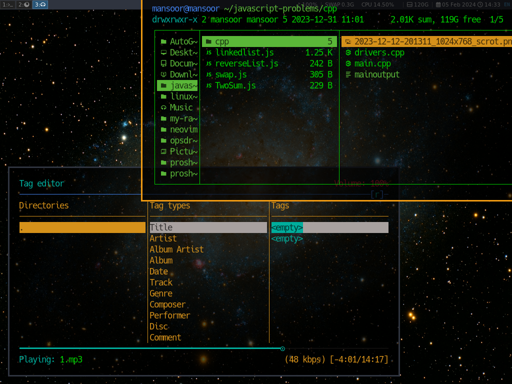

# My Linux Rice

These are all my dotfiles to my own customized rice. Here's a screenshot: 



# Motivation

The main motivation was to become a command line ninja! that's why i got rid of the Unity and customized my own windows from scratch! don't worry if you want to do the same, i will be uploading all my daily tweakings to this repo and all the dependancies.

# Installing i3-gaps
For i3 block first run 
```bash
sudo apt install i3-blocks
```
if it didn't work for u then run the following commands
```bash
sudo apt install meson dh-autoreconf libxcb-keysyms1-dev libpango1.0-dev libxcb-util0-dev xcb libxcb1-dev libxcb-icccm4-dev libyajl-dev libev-dev libxcb-xkb-dev libxcb-cursor-dev libxkbcommon-dev libxcb-xinerama0-dev libxkbcommon-x11-dev libstartup-notification0-dev libxcb-randr0-dev libxcb-xrm0 libxcb-xrm-dev libxcb-shape0 libxcb-shape0-dev
```

Then cd to the directory where you want to download the i3-gaps source code and the run the following commands in the order shown.

```bash
git clone https://github.com/Airblader/i3 i3-gaps
```

```bash
cd i3-gaps
```

```bash
mkdir -p build && cd build
```

install meson using the command
```bash
sudo apt install meson
```

```bash
meson --prefix /usr/local
```

```bash
ninja
```

```bash
sudo ninja install
```
These commands will install i3-gaps.

# Dependancies

| Package Name        | What it does?       | How to install?  |
| ------------- |:-------------:| -----|
| i3wm      | The Basic Core Of My Setup |  `sudo apt install i3`  |
| Ranger      | My file browser with image rendering capability      |     `sudo apt install ranger`  |
| Rofi | MacOS inspired file finder (replacement for dmenu)      |     `sudo apt install rofi`  |
| Compton      | Fix the transparency issue |  `sudo apt install compton`  |
| Feh      | To set a wallpaper      |    `sudo apt install feh`  |
| i3blocks | Status Bar      |     `sudo apt install i3blocks`  |


you will also need to install xclip for copying emojis.

```bash
sudo apt install xclip
```

for notifications we need another package called dunst
```bash
sudo apt install dunst
```


